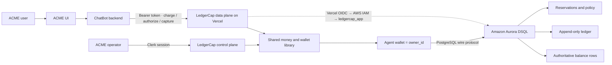
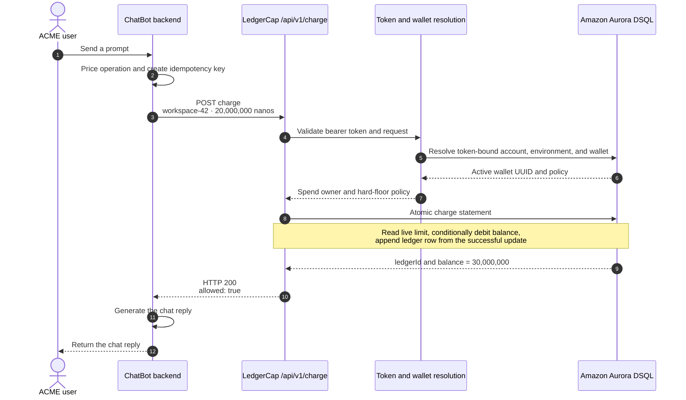
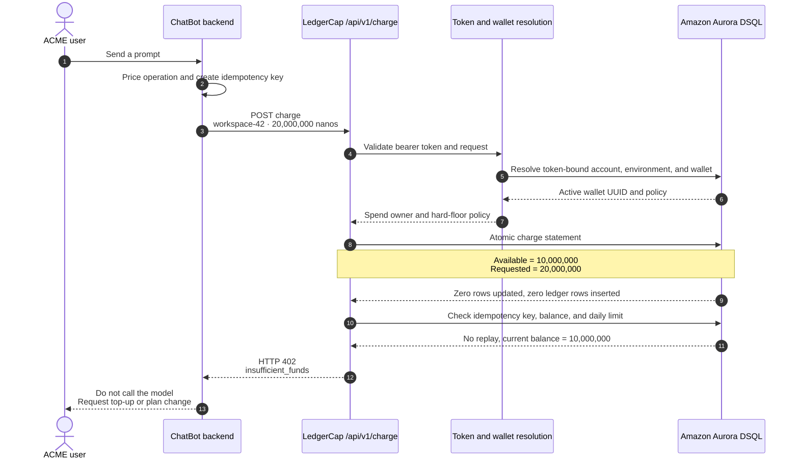

# LedgerCap architecture

> Reads top-to-bottom as a skimmable reference, picture first. The money figures
> throughout are illustrative, not real pricing.

## At a glance

| | |
|---|---|
| **What** | A prepaid spend-cap / metering service: it decides whether an agent's (or customer's) wallet may spend an amount *before* expensive work runs. |
| **Why a service** | A read-then-write counter overspends under concurrency — two callers read the same balance and both spend it. LedgerCap makes the decision *and* records the movement as one atomic Aurora DSQL statement. |
| **How** | The spend decision is a predicate on a conditional `UPDATE`, not a preceding app read. Competing charges conflict on one hot balance row; DSQL optimistic concurrency aborts stale writes; LedgerCap retries `40001`. |
| **Money unit** | Integer nanodollars internally (1 nano = 1e-9 USD). The API accepts `amountNanos` *or* `amountCents`, never both. Floats are never used for money. |
| **Two planes** | Data plane `/api/v1/*` (token-authed, machine-to-machine). Control plane `/api/*` (Clerk session, dashboard). Both call the same money library. |
| **Worked example** | **ACME** — its **ChatBot** feature delegates the prepaid usage decision to LedgerCap before each LLM call. |

## The system, in one picture

The one question LedgerCap exists to answer, before any expensive work begins:

> Is this agent or customer wallet allowed to spend this amount right now?

## Product boundary

LedgerCap is a *reusable accounting boundary*. The consuming product keeps what
differentiates it; LedgerCap owns the parts every metered product re-derives and
must repeatedly audit.

| Consumer owns (e.g. ACME) | LedgerCap owns |
|---|---|
| The ChatBot experience | Customer wallets and prepaid balances |
| Prompt interpretation and reasoning | Hard spend caps and daily limits |
| Model orchestration | Idempotent charges |
| Streaming responses and conversation UI | Reservations: authorize → capture → void |
| The user's conversations and content | An append-only audit ledger |
| | Usage environments, API credentials, operational controls |

The consumer sends a usage decision, receives **allow** or **refuse**, and never
builds or re-audits its own concurrent balance engine.

## Runtime components

**Consumer backend.** The browser sends a plain-language request to the consumer
backend, which determines the usage operation and calls LedgerCap with a
server-side bearer token. The token is never exposed to the browser. Fixed-price
operations call `POST /api/v1/charge` up front; variable-cost operations
`authorize` a safe maximum, run the model, then `capture` the actual amount.

**Data plane (`/api/v1/*`).** Machine-to-machine entry on Vercel. A charge request
carries an integer `amountNanos` or decimal `amountCents` (never both), a wallet or
stable external customer identifier, an idempotency key, and an optional
description. The route is deliberately thin: authenticate → validate → resolve the
spend owner → call the shared money library → map the result to HTTP.

**Control plane (`/api/*`).** Operators use the Clerk-authenticated dashboard to
fund accounts, create wallets, configure limits and rates, inspect the ledger, and
manage tokens. It calls the *same* library functions as the data plane, so the two
interfaces cannot drift apart in money behavior.

**Vercel ↔ AWS auth.** Route handlers run as Vercel Functions. At runtime the
Functions SDK obtains short-lived AWS credentials via OIDC and assumes the
configured IAM role, then mints a short-lived DSQL auth token for the
least-privilege `ledgercap_app` role. No static AWS keys ship in the app.

**Aurora DSQL.** The transactional authority, reached over the PostgreSQL wire
protocol but with *optimistic* concurrency: conflicting writes abort with SQLSTATE
`40001`. LedgerCap retries with bounded exponential backoff and returns exhausted
contention as retryable HTTP `429`, never a generic 500.

## Identity and isolation

Every balance belongs to one opaque `owner_id` — a **wallet UUID**. Each agent,
customer, workspace, or project gets its own wallet, and the wallet's id is the
owner key in `balances`, `ledger`, `holds`, and `settings`. (An account ID can also
appear as an `owner_id` for legacy account-level spend, but the model is
wallet-centric: spend flows through a wallet.)

A wallet is *resolved* from an external identifier such as
`acme:workspace-42`, but that lookup is always scoped by the
authenticated account and token-bound environment. **The external identifier is
never itself an authorization boundary.** Resolving to the wallet UUID gives every
agent an independent hot balance row without duplicating the money implementation.

## Data model

| Table | Role | Key property |
|---|---|---|
| `balances` | Authoritative current state — one hot row per owner | `available = balance_nanos - reserved_nanos`; the charge decision is constant-time as history grows. |
| `ledger` | Immutable audit history | A charge's balance update and ledger insert derive from one writable statement — no debit without its audit entry, and none without its debit. Append-only audit, not double-entry. |
| `holds` | Reserved future spend | Direct charges spend *available* (not total) balance, so they can't consume credit already promised to an in-flight operation. |
| `settings` | Live policy | The charge statement reads the daily limit here, uncached — lowering a cap affects the very next write. |
| `wallets` | Tenant-owned metadata | Account ownership, environment, external ID, status, rules. Holds no money; the UUID points at the shared money tables. |

## Money flows

### Accepted charge

A wallet has 50,000,000 nanos available ($0.05); one reply costs
20,000,000 nanos ($0.02). The consumer creates a stable idempotency key and calls
LedgerCap before model execution. One writable DSQL statement: reads the live daily
limit; confirms the key hasn't settled; conditionally debits the hot row only when
available funds and the daily limit permit; inserts the ledger row from the updated
balance; returns the ledger ID and new balance. Response: `allowed: true`, balance
30,000,000. Only then does the consumer run the model.

### Charge refused at the prepaid floor

Same 20,000,000-nano reply, but only 10,000,000 nanos available ($0.01). The
conditional `UPDATE` matches no row, and because the ledger insert selects only from
a successful update, no ledger entry is created and no money moves.

A zero-row result is ambiguous — it can also mean an idempotency replay or a
daily-limit refusal — so LedgerCap takes a cold classification path: check for a
settled idempotency key, then read current balance and live daily limit. Here it
returns HTTP `402` with `reason: insufficient_funds`. The expensive operation is
*prevented*, not reported after the fact.

If funds suffice but the daily allowance is exhausted, the same no-mutation path
returns `daily_limit_exceeded` instead.

### Fixed price vs. variable model cost

When the amount is known up front, a direct charge is enough. When cost depends on
actual model usage, reserve first:

1. `authorize` the maximum permitted cost;
2. run the model;
3. `capture` the measured final cost; or
4. `void` the hold if the call fails.

The reservation immediately reduces *available* balance, so concurrent calls
cannot collectively promise more credit than the wallet can cover. Capture settles
the real debit and releases the unused remainder.

## Why the charge stays correct under concurrency

The spend decision is a predicate on the `UPDATE`, not a preceding read. Every
competing charge writes the same owner row; DSQL detects the overlap through
optimistic concurrency control and aborts the conflicted statement rather than
committing from stale state. LedgerCap retries `40001` and re-evaluates the
predicate against the newly committed balance. Three guarantees follow:

- a successful charge owns a real serialized balance transition;
- a refused charge changes neither balance nor ledger;
- a contention failure never silently becomes an overspend.

The retry loop is bounded to protect latency and capacity. After eight retries,
the caller gets HTTP `429` with `Retry-After` and can retry the same idempotency key.

## Idempotency contract

Generate one key per logical operation; reuse it only when retrying that same
operation. LedgerCap stores a normalized request fingerprint with the ledger entry.

- **Same key, same payload** → return the original ledger identity, no second debit.
- **Same key, changed payload** → HTTP `409`.
- **New logical operation** → new key.

This stops an ambiguous network timeout from double-charging, and stops a settled
key from being reused for a different amount.

## Performance model

The warm accepted path is intentionally short:

- token identity can be served from a bounded per-function cache;
- wallet resolution is tenant-scoped;
- the hard-cap decision, daily-limit read, debit, and ledger insert are one DSQL
  round trip;
- balance and policy are never cached.

Only replays and refusals take the follow-up classification reads — keeping the
common allowed path fast without weakening the money guarantee.

## HTTP semantics

| Code | Meaning |
|---|---|
| `200` | Charge accepted, or an identical idempotent replay was found. |
| `400` | Malformed JSON, or invalid mutually exclusive money fields. |
| `401` | Missing, malformed, revoked, or unknown token. |
| `402` | Insufficient available funds or daily limit reached; no debit committed. |
| `404` | Requested wallet does not exist for this tenant and environment. |
| `409` | Idempotency key reused with a different payload. |
| `429` | DSQL contention exceeded the bounded retry budget; safe to retry. |
| `503` | The bounded cold-token lookup queue is saturated; retry after backoff. |
| `500` | Unexpected internal failure; database details stay server-side. |

## Architectural invariants

These define correctness and should stay true as LedgerCap evolves:

1. Money entering library functions is integer nanodollars.
2. Every spend owner has one authoritative hot balance row.
3. Available balance is total balance minus open reservations.
4. A charge debit and its ledger entry commit together or not at all.
5. Hard limits are evaluated in the database write predicate against live state.
6. Concurrent money writes conflict on the owner row and retry only `40001`.
7. An idempotency key is bound to the normalized logical request.
8. Wallet lookup and mutation are scoped by authenticated account and environment.
9. Token identity may be cached briefly; money and limits may not.
10. Expected contention exhaustion is retryable, not an internal server error.

## Glossary

- **Nanodollar (nano)** — integer money unit, 1e-9 USD. `MAX_NANOS = 1e15`, under
  JS's 2^53 safe-integer limit. The internal currency of every library function.
- **Owner / `owner_id`** — the opaque key a balance belongs to: an account ID or a
  wallet UUID. The unit of isolation.
- **Wallet** — a customer/workspace/project sub-account; metadata in `wallets`,
  money under its UUID in the shared tables.
- **Hot row** — the single `balances` row per owner that all of that owner's
  charges contend on.
- **Hold** — a reservation that lowers available balance without settling, via
  authorize/capture/void.
- **Data plane / control plane** — token-authed machine API vs. Clerk-authed
  dashboard; both call the same money library.
- **`40001`** — DSQL optimistic-concurrency conflict; retried. (`23505`,
  unique-violation, is *not* retried.)
