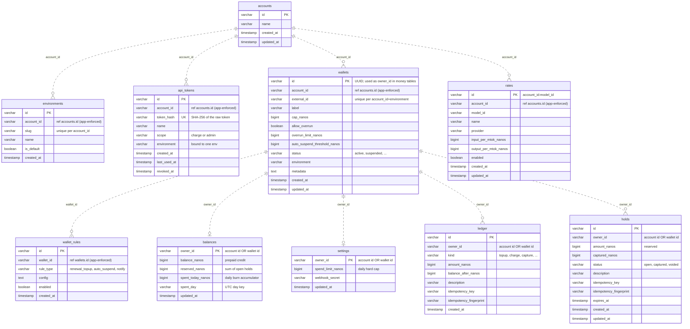

# LedgerCap database schema

The canonical schema is defined in code by `migrateSchema()` / `ensureSchema()` in
[`lib/db.ts`](../lib/db.ts) and applied with `pnpm db:migrate`. This page is the
human-readable view of that source of truth.

Key facts that shape the model:

- **Backed by Amazon Aurora DSQL** (PostgreSQL wire protocol, distributed, optimistic
  concurrency). Money is always **integer nanodollars** in `BIGINT` columns — never floats.
- **One hot row per wallet.** `balances`, `settings`, `ledger`, and `holds` are keyed by
  an opaque **`owner_id`** — the wallet's UUID. Every agent or customer gets a wallet, and
  the same money implementation serves all of them. (An account id can also appear as an
  `owner_id` for legacy account-level spend, but the model is wallet-centric: spend flows
  through a wallet.)
- **No foreign keys.** Aurora DSQL does not provide foreign-key constraints; referential
  integrity is enforced in the application layer
  ([AWS migration guide](https://docs.aws.amazon.com/aurora-dsql/latest/userguide/working-with-postgresql-compatibility-migration-guide.html)).
  Relationships below are drawn **dashed** to signal *logical, app-enforced* links —
  not database-enforced constraints.
- **Authentication is handled by [Clerk](https://clerk.com/), not the database.** Identity
  is delegated to Clerk, and the Clerk user id is used directly as `account_id`. The
  `accounts` table is a leftover from the original password-auth scaffold; `password_hash`
  and `email` are omitted here while the schema is still being refined.

<!-- Regenerate schema.svg from the Mermaid source below after any edit. -->

*Rendered ER diagram ([`schema.svg`](schema.svg)) — the Mermaid block below is the editable source.*

## Notes

- **Wallet is the spend owner.** A wallet's id is the `owner_id` key in `balances`,
  `settings`, `ledger`, and `holds`. `balances` / `settings` hold at most one row per
  wallet (one-to-zero-or-one); `ledger` / `holds` hold many. (The `owner_id` column can
  technically also hold an account id for legacy account-level spend, but the model is
  wallet-centric — an agent gets a wallet.)
- **Uniqueness** (enforced via `CREATE UNIQUE INDEX ASYNC`):
  `api_tokens.token_hash`, `wallets(account_id, environment, external_id)`,
  `environments(account_id, slug)`. Async unique indexes are eventually consistent during
  their build.
- **DSQL specifics visible in the DDL.** Indexes are built `ASYNC`; `ALTER TABLE ADD
  COLUMN` cannot take a `DEFAULT` (later columns are nullable and read via `COALESCE`);
  all money is `BIGINT` nanodollars kept under JS's 2^53 safe-integer limit.
- **Omitted here for clarity:** `perf_samples` (opt-in endpoint timing) and
  `schema_migrations` (the version marker installed last) — infrastructure, not part of
  the money model.
- **Pending code cleanup:** `accounts.password_hash` still exists in the `lib/db.ts` DDL
  (a generated-scaffold leftover); it is unused under Clerk and should be dropped there too.

> The same Mermaid block renders client-side (mermaid.js) on **ledgercap.dev**, so this
> doc and the site can share one source.
